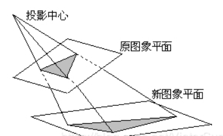
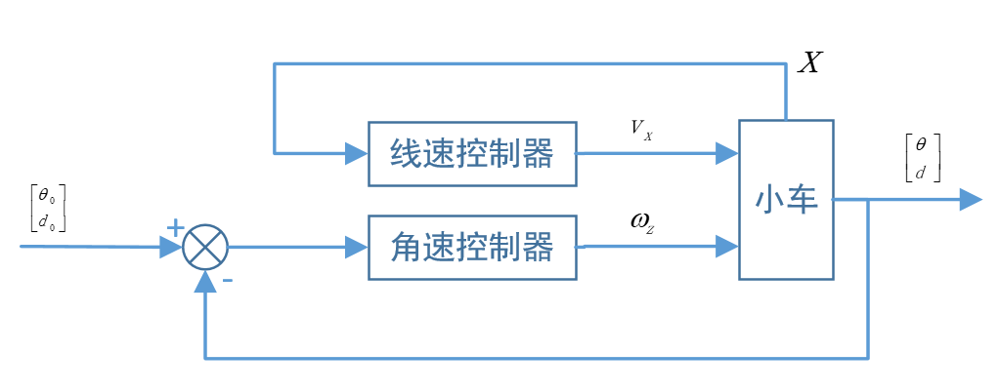

# 设计报告

---

## 任务目标

1.  小车自动找到环境中的绿色“H”停车标，并最终将车停在停车标之上。
2.  沿“H”停车标字母H的两条长边方向将车停入指定区域。


## 图像处理

```flow
zed=>start: 获取RGB图像
hsv=>operation: RGB转HSV颜色空间
seg=>operation: 颜色阈值分割
per=>operation: 透视变换
bnd=>operation: 边界提取
fea=>operation: 特征提取
motion=>end: 运动控制

zed->hsv
hsv->seg->per->bnd->fea
fea->motion
```


### 图像获取

-   ZED相机获取RGB图像
-   高斯平滑滤波

### 颜色分割

1. 颜色空间转换：RGB $\rightarrow$ HSV 

    ```c++
    void cv::cvtColor(src, dst, COLOR_BGR2HSV)
    ```

2. 阈值分割，得到二值图像

    ```c++
    void cv::inRange(src, lowerb, upperb, dst)
    ```

### 透视变换

- 透视变换(Perspective Transformation)是将成像投影到一个新的视平面(Viewing Plane)，也称作投影映射(Projective Mapping). 

    

-   在本项目中，透视变换用两步完成

    1.  标定：固定ZED相机对地倾角，分别取原图与变换后图像的4点坐标，计算透视变换矩阵 

        ```c++
        Mat cv::getPerspectiveTransform	(const Point2f src[], const Point2f dst[])
        ```

    2.  应用：通过上述透视变换矩阵，计算得到原图到新图的透视变换

        ```c++
        void cv::warpPerspective(InputArray src, OutputArray dst, InputArray M, Size dsize, int flags=INTER_LINEAR)
        ```

### 边缘提取

-   使用Canny边界提取算法提取二值图像中的边界

    ```c++
    void cv::Canny (InputArray image, OutputArray edges, double threshold1, double threshold2, int apertureSize = 3, bool L2gradient = false)	
    ```

### 特征提取

1.  提取边界中的封闭轮廓

    ```c++
    void cv::findContours (InputOutputArray image, OutputArrayOfArrays contours, OutputArray hierarchy, int mode, int method)
    ```

2.  最小面积矩形包络

    ```c++
    RotatedRect cv::minAreaRect	(InputArray points)	
    ```

3.  找出所有矩形包络中面积最大者作为目标

4.  获取目标矩形中心坐标 `maxRectangle.center` 

5.  计算矩形两条长边的均值所在直线，作为目标的中轴线

6.  计算目标中轴线的斜率与截距


---

## 运动控制

-   实现效果：正对着字母“H”停车

### 建模

-   转化为巡线模型  
-   上一章中提到的目标中轴线就是该模型中要巡的“线” 
#### 被控量

1.  目标轴线与车前进方向的夹角$\theta$  
2.  目标轴线与车的距离$d$ 
-   控制目标：
    $$
    \begin{cases}
        \theta = 0 \\
        d = 0
    \end{cases}
    $$

#### 控制量
1. 小车前进线速度 $v_x$  
2. 小车航向角角速度 $\omega_z$ 


### 方框图




### 控制器设计

#### 角速控制器

-   基于距离阈值的位置式PD/PID双模控制

-   记角度偏差为 $e_{\theta}(t)$, 距离偏差为 $e_d(t)$，则控制算法由下式描述
    $$
    \omega_z = K_{P\theta} e_{\theta}(t) - K_{D\theta}\frac{\mathrm d\theta}{\mathrm dt} - K_{Pd} e_d(t) - K\cdot K_{Id}\int_0^t e_{d}(\tau)\ \mathrm d\tau
    $$
    其中由距离阈值决定的系数
    $$
    K=
    \begin{cases}
    1 &,|d|>{\rm threshold} \\
    0 &,|d|\leq{\rm threshold}
    \end{cases}
    $$


#### 线速控制器

-   基于阈值的Bang-Bang控制

-   引入新观测量：$x$ 

    -   设小车前进方向所在直线与目标轴线交于点$A$ ，小车所在位置为点$O$  
    -   $x = \overline{OA}$  ，规定当$A$点在车前方时$x$取正数，反之取负数 

-   控制算法如下描述：
    $$
    v_x = 
    \begin{cases}
    +v_{\rm max} &, x>0\ &{\rm or}& \mathrm dx\geq{\rm threshold}\\
    -v_{\rm max} &, x<0\ &{\rm and}& \mathrm dx<{\rm threshold}
    \end{cases}
    $$

    -   Tips：当$x$ 变化量过大时，车应位于目标轴线附近，故使控制量取正极值 


### “平滑滤波”

-   当图像特征不明显（比如距离太远导致目标图像不清晰），或环境干扰较大时，通过测量得到的各量会产生较大的抖动。这种抖动会直接对控制算法产生影响，从而可能导致小车进入“死锁”状态，故平滑滤波显得十分必要。

#### “滤波器”设计

-   基本假设
    -   被控量是连续的，不会产生突变
-   基本思路：
    1.  根据当前测量结果计算被控量$\theta_k$ , $d_k$ 的预报值 $\hat\theta_k$, $\hat d_k$  
    2.  将预报值与上一时刻的真值$\theta_{k-1}$, $d_{k-1}$ 比较，若
        1.  超过阈值$th$ , 则舍弃该时刻的所有测量结果，令$\theta_k=\theta_{k-1}$, $d_k=d_{k-1}$  
        2.  在阈值$th$ 范围内，则采用预报值作为真值，$\theta_k=\hat\theta_k$, $d_k=\hat d_k$  


### 算法流程

```flow
feat=>start: 目标特征
plant=>operation: 被控量计算
wild=>operation: “平滑滤波”
para=>operation: 参数计算
cntrl=>operation: 控制量计算
pub=>end: 执行机构


feat->plant
plant->wild->para->cntrl
cntrl->pub

```


## 代码

```c++
#include<opencv2/opencv.hpp>
#include<stdlib.h>
#include<vector>
#include<string>
#include<ros/ros.h>
#include<geometry_msgs/Twist.h>
#include "std_msgs/String.h"
#include "std_msgs/Bool.h"
#include "std_msgs/Float32.h"
#include <numeric>
using namespace std;
using namespace cv;

#define MAX_TURN (3)
#define NORM2(a,b) ((a)*(a)+(b)*(b))
#define EPS 0.000001
#define PERIORD 5
#define X0_car 350
#define Y0_car 450

double last_angle = -2;
double last_bs = 0;
double last_vx = 0;
double last_omegaz = 0;
double slope_mean = 0;
double bs_mean  = 0;
double errDist[3] = {0};
double errAng[3] = {0};
double errDx[3] = {0};
RotatedRect maxRect;
Point2f meet;
bool ISOBS = false;
bool flag = 0;

void obsCallback(const std_msgs::Bool _isObs) {
    ISOBS = _isObs.data;
}

void perspectiveTransform(const Mat& src, Mat& img_trans) {
    vector<Point2f> corners(4);
    corners[0] = Point2f(275, 229);
    corners[1] = Point2f(404, 229);
    corners[2] = Point2f(236, 363);
    corners[3] = Point2f(466, 363);

    vector<Point2f> corners_trans(4);
    corners_trans[0] = Point2f(300, 274);
    corners_trans[1] = Point2f(380, 274);
    corners_trans[2] = Point2f(300, 374);
    corners_trans[3] = Point2f(380, 374);

    Mat transform = getPerspectiveTransform(corners, corners_trans);
    warpPerspective(src, img_trans, transform, Size(src.cols, src.rows), cv::INTER_AREA);
}

void drawRect(Mat& img, RotatedRect &rect, Scalar clr = (255, 255, 255), int thickness = 1, int lineType = 8) {
    Point2f rectPoints[4];
    rect.points(rectPoints);
    for (int j = 0; j < 4; j++) {
        line(img, rectPoints[j], rectPoints[(j + 1) % 4], clr, thickness, lineType);
    }
}


//检查数据
bool check(double & angle, double & bs) {
    //剔除野点_角度
    if ((int)last_angle == 131 || (int)angle == 131) last_angle = -2;   // 这里魔幻，131是个黑点
    if ((last_angle - (-2)) < EPS) {
        // 初值
        last_angle = angle;
        last_bs = bs;
    } else if (abs(angle - last_angle) > 20 && abs(angle - last_angle) < 170) {
        cout << "野点 detected!\nDifference:  " << abs(angle - last_angle) << endl;
        // 野点剔除
        angle = last_angle;
        bs = last_bs;
        return false;
    }
    // 更新
    last_angle = angle;
    last_bs = bs;
    return true;
}

double PIDlinear(double angle, double bs, double errDist[], double&  last_vx) {
    const double Kp = 0.0001f;
    const double Ti = 1000;
    const double Td = 0;
    const double T = PERIORD;
    const double MaxVx = 0.2;

    // double q0 = Kp * (1 + T / Ti + Td / T);
    // double q1 = -Kp * (1 + 2 * Td / T);
    // double q2 = Kp * Td / T;
    double vx;

    //计算距离
    double dist = Y0_car - meet.y;
    // 基于距离进行bang-bang控制
    if (abs(dist - errDist[0] < 200))
        vx = dist > 0 ? MaxVx : - MaxVx;
    else
        vx = MaxVx;

    cout << "dist :  " << dist << endl;
    cout << "vx :  " << vx << endl;
    errDist[0] = dist;
    errDist[1] = errDist[0];
    return vx;
}

double PIDangle(double angle, double bs, double errAng[], double & last_omegaz) {
    const double Kp1 = -0.007;
    const double Kd1 = 0.0007;
    const double Kp2 = 0.002;
    const double Ki2 = 0.00001;
    const double ThresholdIsInt = 40;
    const double MaxOmegaz = 0.3;

    double omegaz = 0;
    double slope = tan((angle - 90) / 180 * CV_PI);

    errAng[0] = 90 - angle;
    cout << "error angle :  " << errAng[0] << endl;
    double dx = (X0_car - slope * Y0_car - bs) / (sqrt(1 + slope * slope));
    cout << "dx :  " << dx << endl;
    errDx[0] = 0 - dx;
    omegaz = Kp1 * errAng[0] + Kd1 * (errAng[1] - errAng[0]) - Kp2 * (errDx[0]) - (abs(dx) > ThresholdIsInt ? 1 : 0) * Ki2 * (errDx[0] + errDx[1] + errDx[2]);


    errDx[2] += errDx[1];
    errDx[1] = errDx[0];
    cout << "Integral errDx: " << errDx[2] << endl;
    if (abs(dx) > ThresholdIsInt)
        cout << " ! Intergrating ! " << endl;
    errAng[2] += errAng[1];
    errAng[1] = errAng[0];

    // 有界输出
    if (omegaz > MaxOmegaz)
        omegaz = MaxOmegaz;
    else if (omegaz < -MaxOmegaz)
        omegaz = -MaxOmegaz;

    last_omegaz = omegaz;

    cout << "Omegaz :  " << omegaz << "    Last Omegaz:  " << last_omegaz << endl;
    return omegaz;
}

int main(int argc, char **argv) {
    ros::init(argc, argv, "Control");
    ros::NodeHandle nh;
    geometry_msgs::Twist msg;
    ros::Rate loop_rate(20);
    ros::Publisher pub = nh.advertise<geometry_msgs::Twist>("/cmd_vel", 5);
    ros::Subscriber sub_obs = nh.subscribe("/isObs", 2, obsCallback);
    VideoCapture capture;
    capture.open(1);
    if (!capture.isOpened()) {
        printf("摄像头没有正常打开，重新插拔工控机上的摄像头\n");
        return 0;
    }
    waitKey(2000);

    Mat frame, color, edges, img_trans, dstImg;
    while (ros::ok()) {
//=========================获取图像及基本处理=================
        capture >> frame;
        frame = frame(Rect(0, 0, frame.size().width / 2, frame.size().height));
        frame.copyTo(color);
        imshow("Raw", frame);

        GaussianBlur(color, color, Size(3, 3), 0, 0);

//=========================颜色分割===========================
        cvtColor(color, color, COLOR_BGR2HSV);
        // 颜色分割
        inRange(color, Scalar(35, 43, 46), Scalar(90, 255, 255), color);
        imshow("Color Segmentation", color);
//===============================透视变换、边界提取===================
        img_trans = color.clone();
        perspectiveTransform(color, img_trans);
        imshow("Perspective Transform", img_trans);
        dstImg = Mat::zeros(img_trans.rows, img_trans.cols, CV_8UC3);
        Canny(img_trans, dstImg, 100, 300, 3);
        imshow("Boundaries", dstImg);

//========================矩形包络、特征提取========
        // Find contours
        vector<vector<Point> > contours;
        vector<Vec4i> hierarchy;
        int idxMax = 0;
        Mat cntrPic = Mat::zeros(Y0_car + 10, dstImg.cols, CV_8UC3);
        findContours(dstImg, contours, hierarchy, RETR_CCOMP, CHAIN_APPROX_SIMPLE);
        // Bounding rectangle and Draw
        vector<RotatedRect> rects(contours.size());
        double maxArea = 0;
        for (int i = 0; i < contours.size(); i++) {
            rects[i] = minAreaRect(Mat(contours[i]));
            //drawRect(cntrPic, rects[i]);
            double area = rects[i].size.width * rects[i].size.height;
            if (area < maxArea) continue;
            maxArea = area;
            maxRect = rects[i];
            idxMax = i;
        }
        // Lost sight of object
        if (maxArea == 0) {
            cout << "Object not Found!!\n" << endl;
            if (errAng[0] < 10) { // H is right under our wheels.
                for (int i = 0; i < 70; i++) {
                    msg.linear.x = 0.3;
                    msg.linear.y = 0;
                    msg.linear.z = 0;
                    msg.angular.x = 0;
                    msg.angular.y = 0;
                    msg.angular.z = 0;
                    pub.publish(msg);
                    waitKey(5);
                }
                cout << "\nDone!" << endl;
                return 0;
            }
            continue;
        }

        drawContours(cntrPic, contours, idxMax, Scalar(0, 255, 0), 1);
        drawRect(cntrPic, maxRect, Scalar(255, 255, 255), 2);
        line(cntrPic, Point(0, dstImg.rows - 1), Point(dstImg.cols - 1, dstImg.rows - 1), Scalar(255, 255, 255), 1, CV_AA);

        // 找出面积最大的矩形的2条长边，二者均值作为轴线
        double angle = -1;
        slope_mean = 1.0 / EPS;
        bs_mean = 1.0 / EPS;
        Point2f pts[4];
        // 矩形的四个点0,1,2,3按逆时针顺序排列
        maxRect.points(pts);
        circle(cntrPic, pts[0], 10, Scalar(255, 0, 0)); //Red
        circle(cntrPic, pts[1], 10, Scalar(0, 255, 0)); //Green
        circle(cntrPic, pts[2], 10, Scalar(0, 0, 255)); // Blue
        circle(cntrPic, pts[3], 10, Scalar(0, 255, 255)); // Yellow
        circle(cntrPic, maxRect.center, 5, Scalar(255, 255, 0));
        if (NORM2(pts[0].x - pts[1].x, pts[0].y - pts[1].y) < NORM2(pts[0].x - pts[3].x, pts[0].y - pts[3].y)) {
            // 边01是短边，取边01和边02中点连线作为中轴
            Point2f  L[2];
            L[0].x = (pts[0].x + pts[1].x) / 2;
            L[1].x = (pts[2].x + pts[3].x) / 2;
            L[0].y = (pts[0].y + pts[1].y) / 2;
            L[1].y = (pts[2].y + pts[3].y) / 2;
            line(cntrPic, L[0], L[1], Scalar(0, 0, 255), 2, 8);

            if (abs(L[0].y - L[1].y) > EPS) {
                slope_mean = (L[1].x - L[0].x) / (L[1].y - L[0].y);
                angle = atan(slope_mean) / CV_PI * 180 + 90;
                bs_mean = L[0].x - L[0].y * slope_mean;
            } img_trans = color.clone();
        } else {
            // 边03是短边，取边03和边12中点连线作为中轴
            Point2f  L[2];
            L[0].x = (pts[0].x + pts[3].x) / 2;
            L[1].x = (pts[1].x + pts[2].x) / 2;
            L[0].y = (pts[0].y + pts[3].y) / 2;
            L[1].y = (pts[1].y + pts[2].y) / 2;
            line(cntrPic, L[0], L[1], Scalar(0, 0, 255), 2, 8);

            if (abs(L[0].y - L[1].y) > EPS) {
                slope_mean = (L[1].x - L[0].x) / (L[1].y - L[0].y);
                angle = atan(slope_mean) / CV_PI * 180 + 90;
                bs_mean = L[0].x - L[0].y * slope_mean;
            }
        }

//=========================PID======================
        //剔除野点
        circle(cntrPic, Point(X0_car, Y0_car), 10, Scalar(125, 125, 0));
        check(angle, bs_mean);

        // 小车轴线与目标轴线的交点
        meet.y = 1.0 / tan((angle - 90) / 180 * CV_PI) * (X0_car - bs_mean);
        meet.x = X0_car;
        circle(cntrPic, meet, 10, Scalar(255, 0, 255));
        line(cntrPic, Point(X0_car, Y0_car - 5), Point(X0_car, 1), Scalar(255, 255, 255), 1);
        cout << "meet(" << meet.x << ',' << meet.y << ")" << endl;
        imshow("Objects of Interest", cntrPic);

        cout << "angle =" << angle  << "   slope = " << slope_mean << "  b = " << bs_mean << endl;

        if (1) {
            flag = 1;
        }
        if (flag == 0) {
            msg.linear.x = 0.1;
            last_vx = msg.linear.x;
            msg.linear.y = 0;
            msg.linear.z = 0;
            msg.angular.x = 0;
            msg.angular.y = 0;
            msg.angular.z = PIDangle(angle, bs_mean, errAng, last_omegaz);
            last_omegaz = msg.angular.z;
        } else {
            msg.linear.x = PIDlinear(angle, bs_mean, errDist, last_vx) ;
            last_vx = msg.linear.x;
            msg.linear.y = 0;
            msg.linear.z = 0;
            msg.angular.x = 0;
            msg.angular.y = 0;
            msg.angular.z = PIDangle(angle, bs_mean, errAng, last_omegaz);
            last_omegaz = msg.angular.z;
        }
        cout << endl;

        pub.publish(msg);
        ros::spinOnce();
        loop_rate.sleep();
        waitKey(PERIORD);
    }
    return 0;
}

```


